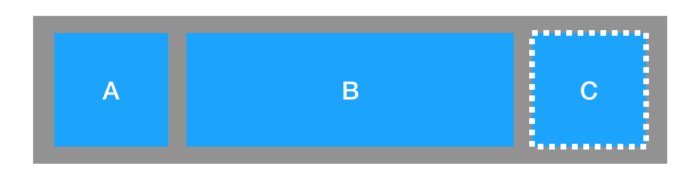
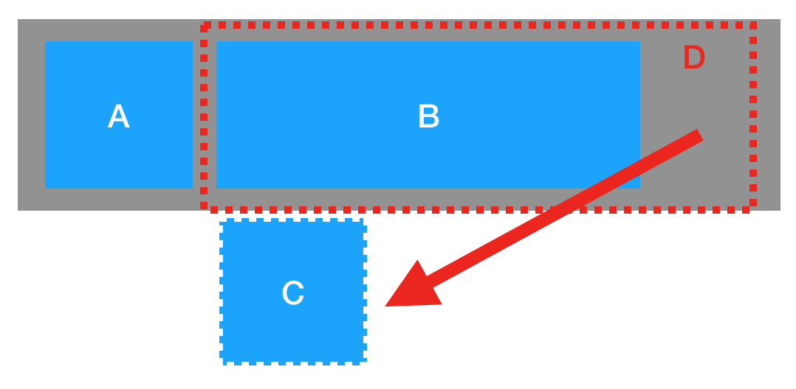

---

title:  flex-wrap的妙用
date:  2019-05-06 23:28:00

---

> 最近接到一个比较棘手的布局需求，只能用flex实现，并且无法使用js计算，经过和同事们的讨论最终实现了，各位看官往下看

## 布局要求

1. `A` `B` `C`单行布局，`A`的宽度固定，`B`、`C`宽度可变


2. 当宽度不够时，不显示`C`



3. 若B的内容宽度过长，最大伸长到容器右边


##  解决方案

我们尝试了各种方案，但是`B`和`C`的宽度比例都不知道，我们得出结论这个方案不可行，只能请产品修改方案，`B`和`C`同时伸缩。后来**qfish**同学提出了一个非常牛逼的想法: 在`B`和`C`外面在加一层容器，同时设置`flex-wrap: wrap`就可以实现我们想要的效果, 原理如下:
```css
#D {
  flex-wrap: wrap;
  height: 50px;
  overflow: hidden;
  flex-grow: 1;
}
```

由于设置了`flex-wrap: wrap`，当`D`容器放不下`C`时，`C`就会折行，跑到下一行，然而...，由于`overflow: hidden`，我们没有办法看到它，也就是说`C`是存在的，只不过我们看不到而已，而且`C`是定高的，不会影响整体布局。



在明白背后的原理后，我不由得觉得**qfish**同学脑子很灵活，也庆幸自己又学会了一招，也验证了一个真理:
> CSS技巧是学不完的！-- 鲁迅

## 局限性

以上解决方案只限于整体高度固定，如果无法确定`A`、`B`、`C`最大高度，就无法通过设置D的高度来来隐藏`C`，因而无法实现想要的效果。

>转念一想，或许可以通过设置`B`的`margin-bottom:9999px`, `D`的`margin-bottom: -9999px`,待验证...


## 收获

- 还是要多交流，往往你觉得真的不行了的时候，其实还是有路可以走的

- 多做，多积累，不要等到书到用时方恨少，**qfish**同学能想到这个方案，一定有着过人的积累