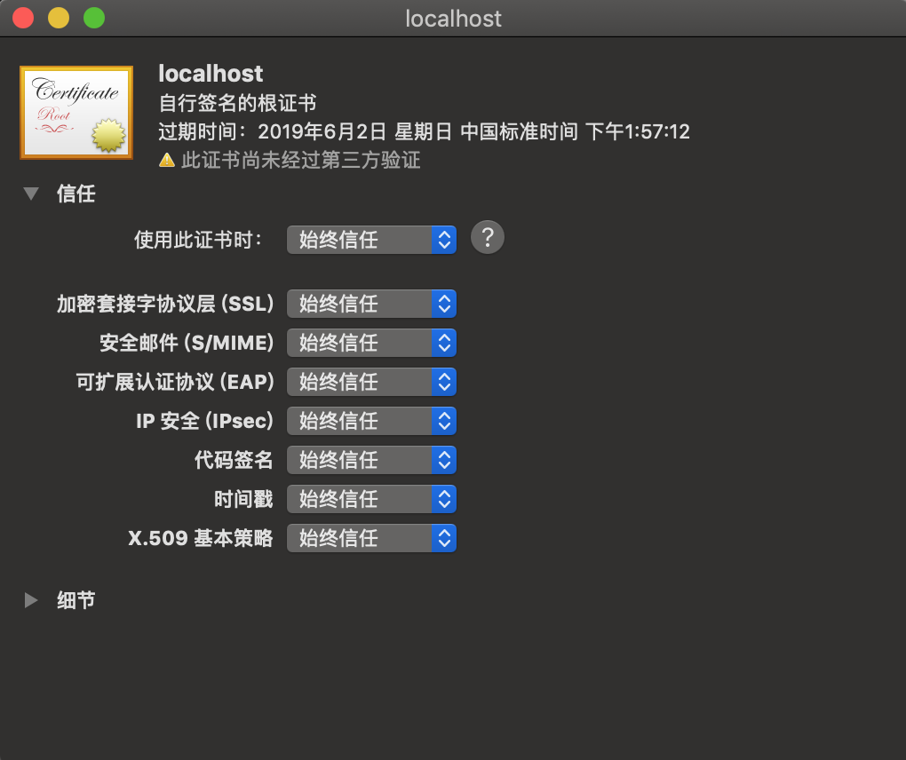
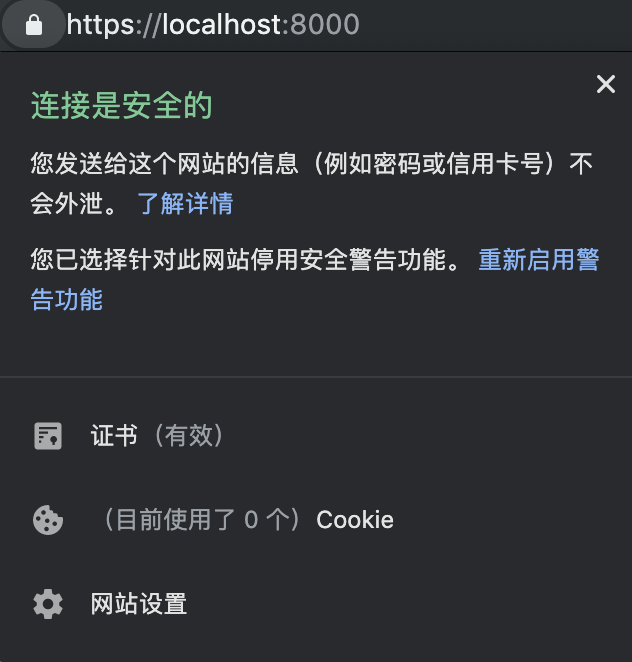

---

title:  搭建Node.js本地https服务
date:  2019-05-03 15:00:00

---

> https相对http有着更好的安全性，越来越多的网站开始使用https服务正是出于安全方面的考虑。在我们日常开发时，有时也会需要搭建本地https服务，本文介绍采用Node.js搭建https服务的过程，希望对读者有所帮助。

## 我，CA，打钱

相信大家对https都有一定的了解，都知道需要一个叫做`证书`的东西，但是这个东西是从哪来的？没错就是由`CA（Certificate Authority）`颁发的。证书可以看作身份证，而`CA`就是派出所。我们平时在浏览器里访问的网站的证书往往是由比较知名的`CA`颁发的，而且往往是需要收费的（当然也有免费的，例如`letsencrypt`）。那我们要搭建本地https服务的话是不是要去这些`CA`申请证书呢？要是这样的话那真是太麻烦了，幸好我们可以借助`openssl`自己扮演`CA`的角色，然后给我们的server颁发证书，很多企业的内网都是采用这种`自签名`证书实现https服务的。接下来我们看看如何把自己变成`CA`:

```bash
# step1: 生成CA私钥
openssl genrsa -out ca.key 4096

# step2: 生成证书签名请求
openssl req -new -key ca.key -out ca.csr

# step3: 证书签名，生成根证书
openssl x509 -req -in ca.csr -signkey ca.key -out ca.crt
```

通过以上步骤我们生成了根证书`ca.crt`,然后我们将证书设置为始终信任



## 我，server，求证

同过上面的步骤，我们成功的把自己变成了一个`CA`，接下来我们需要给自己的server申请证书
### Step 1. 创建相关配置文件
主要有两个配置文件`server.csr.conf`和 `v3.ext`
其中`server.csr.conf`制定了server证书签名请求的相关信息比如 国家 城市 域名等信息，`v3.ext`主要作用是指定`subjectAltName`，`subjectAltName`的作用和`common name`类似，都是用于制定域名的,不过前者配置更灵活更强大
```bash
# server.csr.conf
# 生成证书签名请求的配置文件
[req]
default_bits = 4096
prompt = no
distinguished_name = dn

[dn]
C=US # 国家
ST=RandomState # 州
L=RandomCity # 城市
O=RandomOrganization # 组织
OU=RandomOrganizationUnit # 组织单元
emailAddress=hello@example.com # 邮箱
CN = localhost # Common Name 域名
```

```bash
# v3.ext
# CA对server请求签名的配置
authorityKeyIdentifier=keyid,issuer
basicConstraints=CA:FALSE
keyUsage = digitalSignature, nonRepudiation, keyEncipherment, dataEncipherment
subjectAltName = @alt_names

[alt_names]
DNS.1 = localhost
```
### Step 2. 申请证书

设置完配置文件，接下来可以给我们的服务器申请证书了

```bash
# step1: 生成服务器的私钥
openssl genrsa -out server.key 4096

# step2: 生成证书签名请求
openssl req -new -out server.csr -key server.key -config <( cat server.csr.conf )

# step3: CA对csr签名
openssl x509 -req -in server.csr -CA ca.crt -CAkey ca.key -CAcreateserial -out server.crt  -sha256 -days 365 -extfile v3.ext  
```

## 我，server，干活

经过上面的步骤，我们成功的扮演了CA并给自己的server颁发了证书，接下来就是在nodejs中配置证书

```js
const https = require('https')
const fs = require('fs')

const options = {
  key: fs.readFileSync('./server.key'), // 私钥
  cert: fs.readFileSync('./server.crt') // 证书
}

const server = https.createServer(options, (req, res) => {
  res.writeHead(200)
  res.end('hello world\n')
})

server.listen(8000)
```

然后启动服务

```bash
node server 
```

打开浏览器，看见🔒了吗？



## 写在最后

以上就是本地开发环境使用Node搭建https服务的流程，希望对你有所帮助

## 参考

1. [How to get HTTPS working on your local development environment in 5 minutes](https://medium.freecodecamp.org/how-to-get-https-working-on-your-local-development-environment-in-5-minutes-7af615770eec)
2. [What is a CSR (Certificate Signing Request)?
](https://www.sslshopper.com/what-is-a-csr-certificate-signing-request.html)
3. [What is the SSL Certificate Common Name?
](https://support.dnsimple.com/articles/what-is-common-name/#common-name-vs-subject-alternative-name)